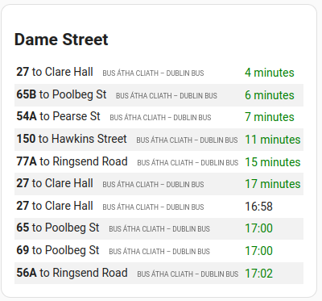

# Overview
This addon packages up my [Transport for Ireland GTFS REST API](https://github.com/seanblanchfield/tfi-gtfs) project, which proxies *Transport for Ireland's* GTFS-R feed into an easy-to-use REST API. Furthermore, this addon consumes that REST API and creates/updates Home Assistant entities with real-time data about each specified transport stop.

You can independently consume the REST API by connecting to it directly at http://homeassistant.local:7341/api/v1/arrivals. You can also click "Open Web UI" on the addon page in Home Assistant to access it at its ingress URL (note that ingress URLs expire).

See the [README](https://github.com/seanblanchfield/tfi-gtfs) file at the main project for further details about this project. 

# Configuration
To use this addon you must register a free account at https://developer.nationaltransport.ie/ to obtain API keys (you just need the "primary" key). You must set these in the configuration screen after you have this addon installed.

In addition, you must specify a number of transport stops that it should monitor. You specify these stops in a comma-delimited list using the regular stop number that is normally printed on the bus stop. You can also see the stop numbers on the official interactive [Journey Planner Map](https://www.transportforireland.ie/plan-a-journey/).  

# Displaying Real-Time Arrivals in Home Assistant



A custom card to display upcoming arrivals at a given stop is provided in the repository in `tfi-gtfs-card.js`.

To use it, place it in your `/config/www/` directory. The contents of this directory are served under the `/local` path by your Home Assistant instance (i.e., at `http://homeassistant.local/local/`).  To register the card, include it as a resource in one of the usual ways, as described by the [resource docs](https://developers.home-assistant.io/docs/frontend/custom-ui/registering-resources/).

```yaml
- url: /local/tfi-gtfs/tfi-gtfs-card.js
  type: module
```

Do a hard reload on your web browser (I find it useful to reload with "disable cache" checked in the dev tool Network panel). You should now see a custom "*Transport for Ireland GTFS Card*" in the *Add Card* dialog. It allows you to specify a stop number, API URL, refresh interval, and maximum number of upcoming arrivals to display.

# Disk Space Requirements

This addon requires a few hundred megabytes of disk space to run. It downloads the static GTFS zip file, which is quite large, and extracts it to the data dir. Then it processes it and stores the results in *redis*, which persists its data into a `dump.rdb` file in the data dir. The size of the *redis* file is small unless you specify a very long list of stops to monitor.

All this data is stored in the addon's `/data` directory, which persists across restarts. This allows restarts of this addon to be pretty quick, since *tfi-gtfs* will just reload its state from the `dump.rdb` file.

> Note: On Home Assistant OS, the `/data` dirs in addons can be found on the host at `/mnt/data/supervisor/addons/data/`.

# Consider joining the Dublin Smart Home mailing list

There's a [Dublin Smart Home](https://groups.google.com/g/smart-home-dublin) google group. Consider joining it!
